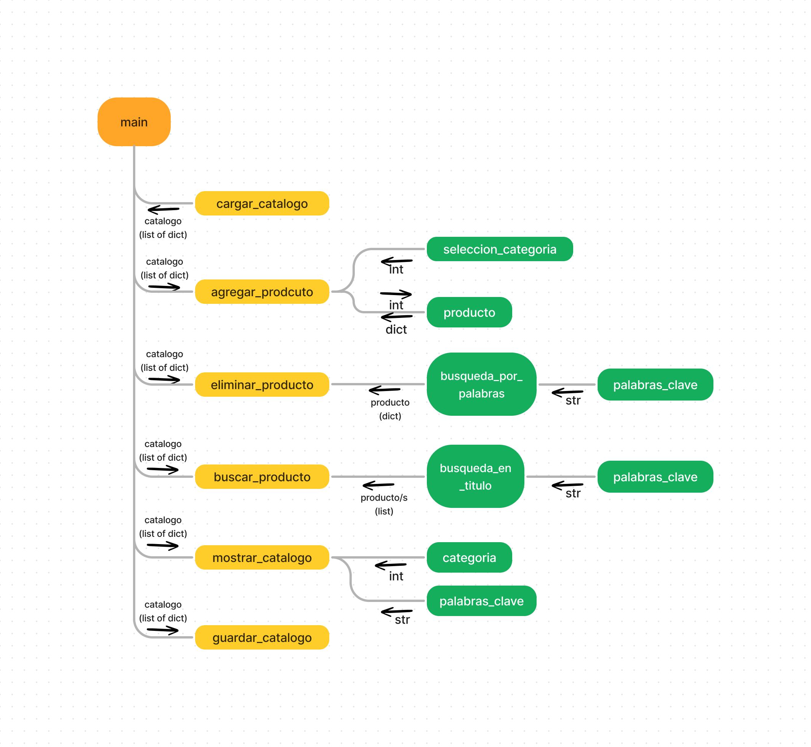

[](https://classroom.github.com/a/LCXMIOgt)

# Proyecto

## Descripcion General del Proyecto

El presente proyecto tiene como objetivo principal actualizar el sistema de renta y venta de un servicio de streaming. Se requiere desarrollar un programa que permita una interaccion eficiente y sencilla que permitan la manipulacion del catalogo de productos.

El sistema proporcionara una serie de menus que faciliten la manipulacion y gestion de los catalogos de produtos. Quien acceda al sistema podran acceder a algun catalogo, agregar/eliminar productos, realizar una busquedas y visualizar informacion detallada sobre los productos

Algunas de las funcionalidades del programa incluyen la carga inicial del catalogo que se encuentre almacenado en un archivo, capacidad de agregar o eliminar productos, busqueda por palabras clave del titulo, y la opcion de mostrar, guardar y cargar un catalogo

## Tabla de contenidos

- Proyecto
  - Descripcion General del Proyecto
  - Tabla de contenidos
  - Estructura del proyecto
  - Funciones
  - Intruciones de uso
  - Comentarios sobre la implementacion

## Estructura del proyecto


<sub>_**click [aqui](https://www.figma.com/file/gGUbw0SLhhbP5NFplgt1iu/Untitled?type=whiteboard&node-id=0%3A1&t=nSldvbEi6irod2cM-1) Para revisar el diagrama en mejor resolucion**_</sub>

-El diagrama de estrucutra que guio este proyecto, fue creado de tal manera que se pueda apreciar de una manera sencilla la estructura del trabajo a seguir. Gracias al diagrama creado se pudo realizar la implementacion a python sin tantos problemas de estructura general del programa.

## Funciones

Click [aqui](./funciones.md) para ir a las funciones

## Intruciones de uso

1. Para hacer uso del sistema de catalogos, solo basta con tener python instalado en el sistema, y tener descargados los archivos del repositorio
2. Para iniciar el programa hay que abrir la terminal en donde se encuentran los archivos de este repositorio y escribir:

    ```cmd
    py catalogo.py
    ```

3. Una vez desplegado el menu principal, se tiene que cargar el archivo donde se encuentre el catalogo, esto escogiendo la opcion no.5 (El programa puede crear un achivo nuevo con un catalogo vacio si es que no se cuenta con un archivo previo).
4. Para hacer uso de la manipulacion y control del catalogo basta con escoger una opcion(agregar,eliminar, mostrar catalogo, buscar) para despues seguir las instrucciones que el sistema pida.
5. Una vez terminada la manipulacion del catalogo, se tendran que guardar los cambios hechos seleccionando la opcion no.6 del menu principal.

## Comentarios sobre la implementacion

### Respecto al diseno del programa

El programa satisface los requerimentos, aunque hay ciertas excepciones y limitaciones que tiene el programa:

- La busqueda de productos se basa en palabras clave del titulo. La coincidencia de las palabras clave puede no ser precisa, por lo que se podran no encontrar todos los productos si las palabras no coinciden exactamente con el titulo o si los prodcutos no estan bien escritos.
- El sistema no valida si hay productos duplicados y la eliminacion se hace cuando se encuentra un unico producto, por lo que se presentaria un problema si existen prodcutos duplicados.
- El sistema trabaja con un catalgo y estrcutura especifica para todos los productos, si se deseara expandir el catalogo para incluir mas categorias, se tienen que hacer varias modificaciones adicionales para que se pueda escalar.
  
### Respecto a la implementacion

Para la implementacion fue de gran ayuda un diagrama de estrcutura tan sencillo, aunque durante la creacion de los modulos y las funciones, para dejar mas manejable el codigo se tuvieron que crear muchas mas funciones que en escencia se entienden que pasan en el diagrama, pero en la implementacion resultaba mas facil separar el codigo en partes aun mas pequenas.

- Un ejemplo es la impresion de los menus y la seleccion de opciones dentro de los menus. Bien se pudo dejar el codigo que imprime cada menu en su respectivo menu (principal, agregar_producto, mostrar_catalogo), pero como el codigo para la impresion y seleccion no se diferenciaban en nada entre las funciones de menu, se opto por crear tres funciones que fueron:
  - opciones_menu(): Almacena y regresa un diccionario de las opciones de los menus
  - imprimir_menu(): Imprime el diccionario resultante de opciones_menu()
  - seleccion_opciones(): Para escoger la seleccion de los diferentes menus, esta funcion recibe la lista de opciones del menu, y se adapta la seleccion de acuerdo al numero de oppciones en el diccionario
- Otro de los muchos ejemplos fue con la implementacion de una funcion para que verifique si el catalogo ya fue cargado en el programa, de lo contrario no se pueden usar las opciones para manipular el catalogo
- Durante la implementacion en Python, fue de gran utilidad el uso de los bloques try-except, ya que con estos durante todo el proceso permiten visualizar mejor los problemas que puedan surgir, por ejemplo si alguna variable no es del tipo de dato que se esperaba o durante las funciones de busqueda que se estuviera iterando bien sobre el catalogo, en resumen, los bloques try-except ayudaron mucho durante las depuraciones.

### Respecto al uso de los modulos

De forma general el uso de ambos modulos fue un poco trivial, porque primero se empezo a trabajar en el modulo menu.py que maneja toda la interfaz del sistema, una vez teniendo ese modulo, no fue mas que empezar a trabajar en el otro modulo que hace toda la manipulacion para que al final solo se importara el modulo de utilidades en el de menu y se agregaran las funciones en cada opcion escogida (agregar/eliminar/buscar un producto, mostrar/cargar/guardar un catalogo).
En total dos modulos fueron los necesarios para la creacion del sistema

- Modulo menu.py: Este modulo se caracteriza por tener funciones que estan enfocadas a la interfaz del sistema y su interaccion entre menus.
- Modulo catalogo_utils.py: Este modulo se enfoca en toda la manipulacion de los catalogos, en general en todas las funcionalidades esperadas para el sistema (agregar/eliminar/buscar un producto, mostrar/cargar/guardar un catalogo).
